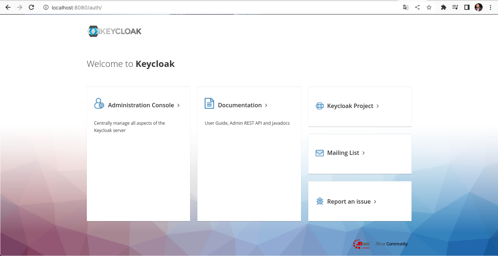
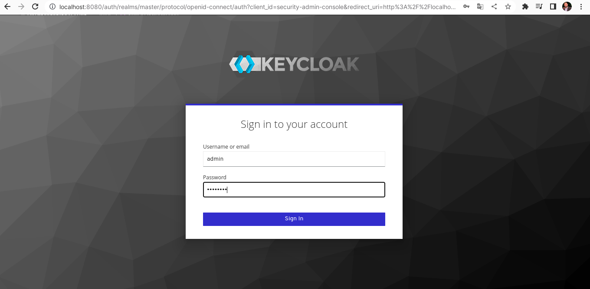
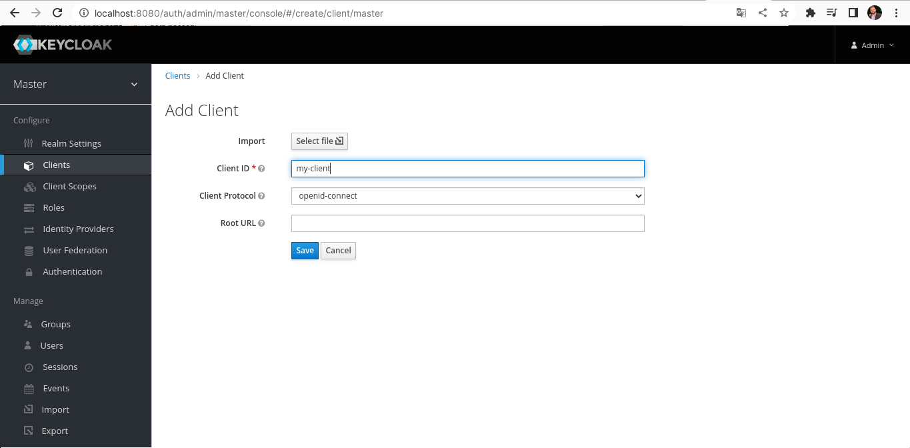
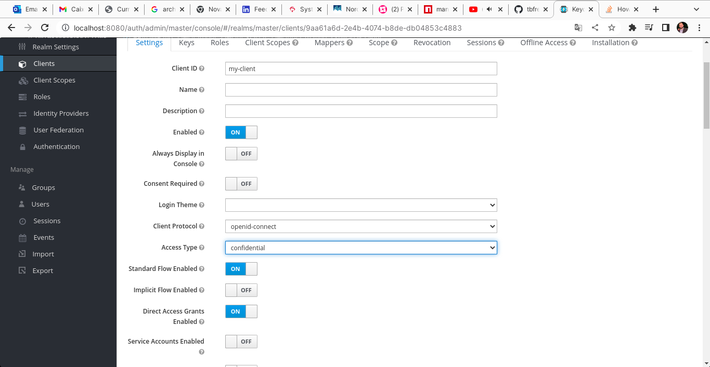
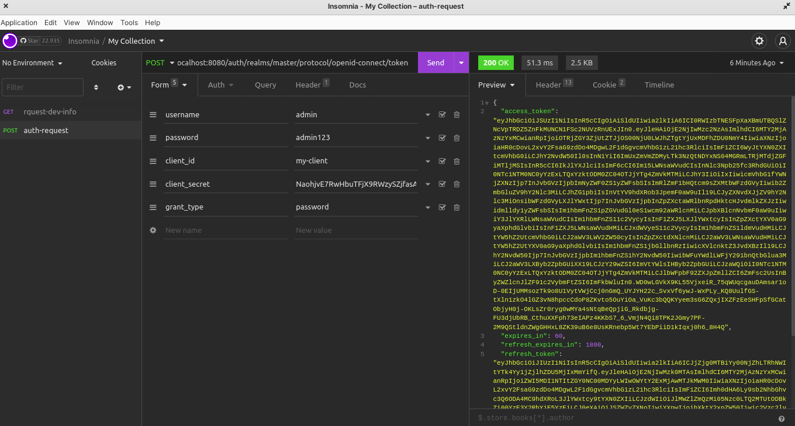
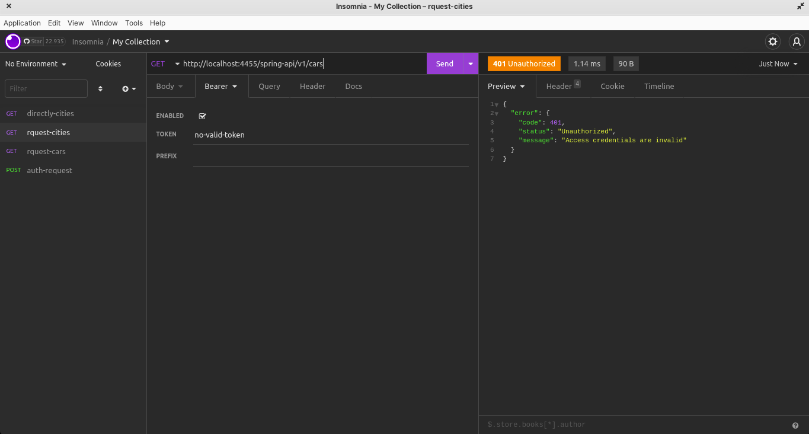
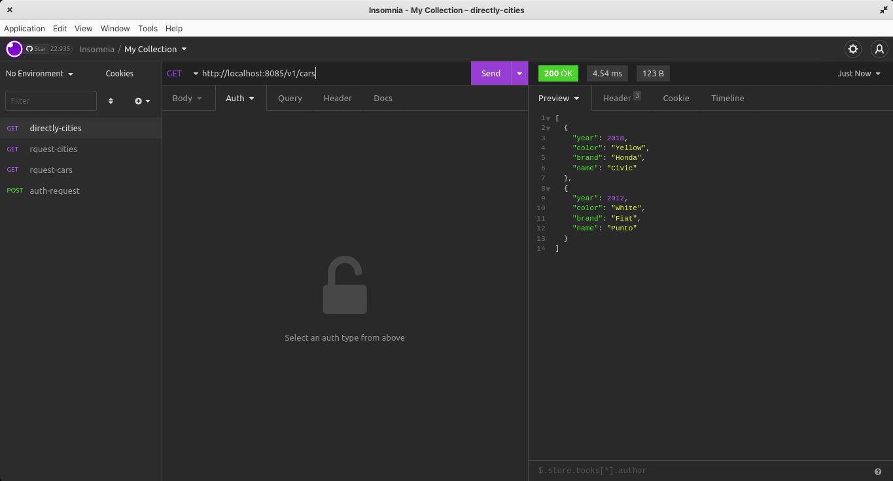
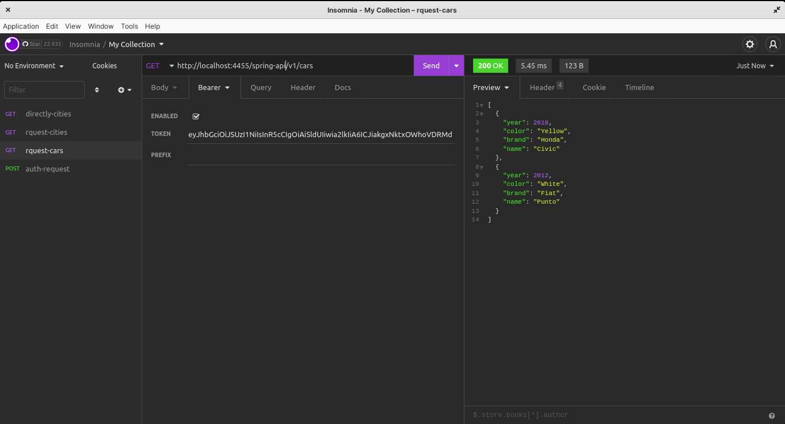

# About

Hello, have you been listen about OAUTH2 ? And do you know what is a proxy ?

In this simple, but teachable project, we can reach the main concepts of them. 

## How ?

Using a open source project as a auth module[Keycloak], to generate a valid Json Web Token and throw forward to a proxy[Ory Oathkeeper].


## Keycloak 

An excelent free auth module, wrote in Java, as we can see on its web page. [keycloak-page](https://www.keycloak.org/). 

Its over APACHE2.0 license. Thus, in case you wanna try it, read the license doc.

## Ory Oathkeeper

"Ory is the largest open source community in the world for cloud software application security". [ory-page](https://www.ory.sh/docs/welcome). 

We gonna use one of its products, the incredible proxy wrote in Golang(:heart:).

Also over APACHE2.0 license.

## What you need

Have installed _docker_ and _docker-compose_ in your system is all you need to run the project. [docker-main-page](https://docs.docker.com/engine/install/ubuntu/)

Just follow the steps to be able to run any containers you wish over the kernel layer of your system.

## Start it

As simple as it could be, just open a terminal and type on the root folder of this project:

    ./start.sh

A *.sh* will be executed, raising up four docker containers, to simulate a autenticate local area. Among this containers, two REST apis will be exposed, making necessary a valid token to get the response. But, before check the response over HTTP1.1, we need create a keycloak client.

Keycloak can be sliced in how environments you wish. But we gonna use what has already come. The allmight _master_. :volcano:

### Creating a keycloak client

1. Let put hands on. Open your browse in _localhost:8080_ as showned below:



2. On admin console, type __admin__ as user and __admin123__ as password (set of docker-compose).



3. Lets create a client named __my-client__:



4. Lets change to _confidential_ option, so we must use the Client Id and the Secret Id as part of the authentication.



* You need to enter a valid URI redirect page. In any case, just type _localhost_ to pass by this option.

5. Get the client and secret values on _Credential_ TAB:


Done for now. Lets test the Oauth2 flow using admin user and the my-client scope.

### Testing Authorization

1. Install a UI to http request. _Postman_ and _Insomnia_ are great options.

* https://www.postman.com/
* https://insomnia.rest/

2. Lets get a valid JWT sending a POST request to:

    localhost:8080/auth/realms/master/protocol/openid-connect/token

And using Form URL Encodend, we send:

```
    {
        username: admin,
        password: admin123,
        client_id: my-client,
        client_secret: {past_secret_here},
        grant_type: password
    }
```

3. Check if you got a __200__ status Request with a valid JWT:



* We are using OpenID Connection, what allow us make this type of requisition. 

### Testing Ory Proxy

Until this point, all we got is a functional auth module. With Ory Oathkeeper well pointed and seted by the files _jwks_ and _rules_ files, we are ready to test our embedded APIs. 

1. Lets make a GET requisition to _http://localhost:4455/spring-api/v1/cars_ with no valid token: 



2. We are passing throught Ory Proxy(:4455) to receive any response from API. If you wanna do it directly, the ports are being exposed by docker. So, we can make:



3. With a valid token on header to fill the Authorization Header, we can get the response from successfull way:

Cities API                 | Cars API
:-------------------------:|:-------------------------:
   |

### Thanks

Nice, ham ? Setting up this way, you __wont__ need to embebbed any auth informatoion on server side. Just put any new service on proxy tracker throught the the _rules.json_ file. (read ory docs)
______________________________

·Tarcísio B F Jr @Brasilia:01-08-2022 


